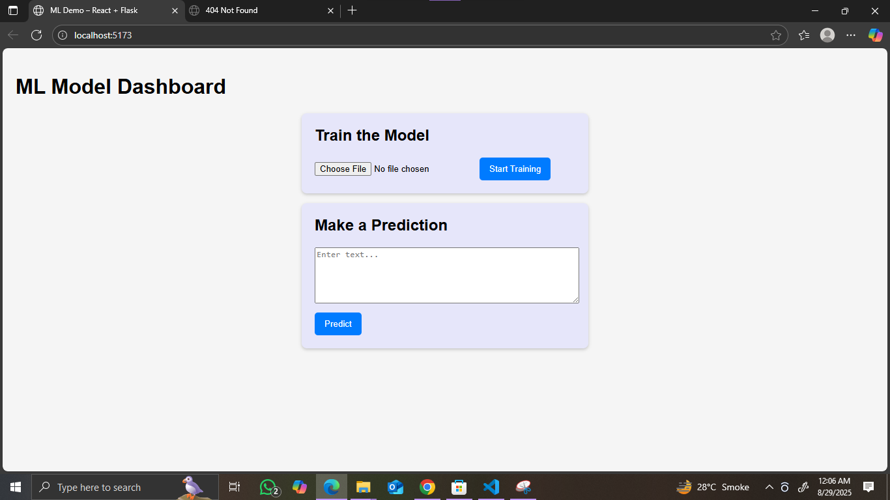
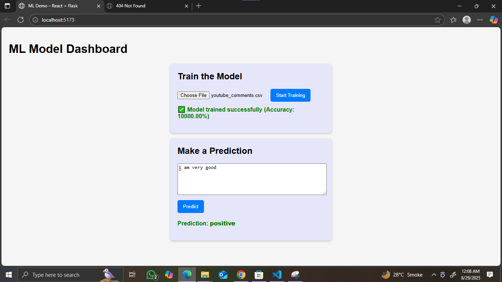

# Flask ML Backend with React Frontend


A simple machine learning application where you can **train a model** on text data and **make predictions** using a React frontend. The backend is built with **Flask**, and the frontend uses **React + CSS**.

---

## Features

- Train a machine learning model (Logistic Regression) on your CSV dataset.
- Predict labels for unseen text.
- Flexible CSV column handling (`text` or `comment` + `label`).
- Cross-Origin support with Flask-CORS.
- Frontend integration with React for easy predictions.

---
## 📸 Screenshots
| 

|  Prediction # 1 | Prediction # 2|
|-----------|----------------|
|  | 

---

## Requirements

- Python 3.8+
- Node.js 16+
- pip packages: `flask`, `flask-cors`, `pandas`, `scikit-learn`, `pickle`

Install Python dependencies:

```bash
pip install flask flask-cors pandas scikit-learn
